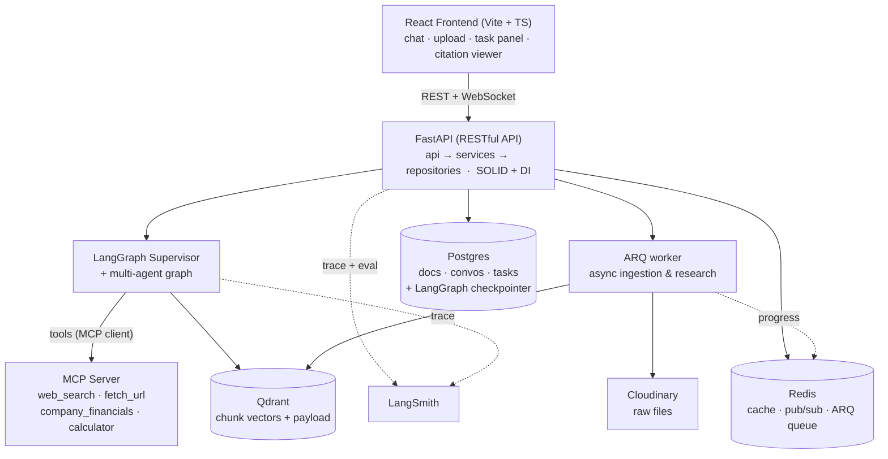
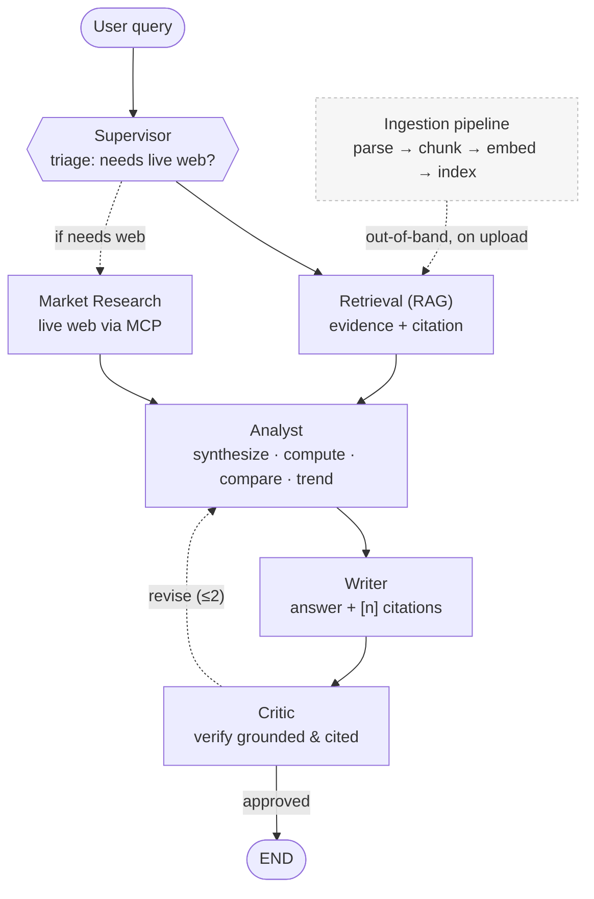

# FinSight — Architecture & Design

This document is the engineering source of truth for FinSight: agent roles, communication
flows, the RAG pipeline, the async task model, the data model, and the conventions that
keep the codebase SOLID.

---

## 1. System Overview



### Design principles
- **Conversation memory lives in Postgres**, via LangGraph `PostgresSaver` (per-thread
  checkpoints) and `PostgresStore` (long-term user memory). Redis is **never** the source
  of truth for conversation state.
- **Redis** is for: response/embedding/RAG caches, pub/sub streaming of background task
  progress, rate-limiting, and as the ARQ queue backend.
- **SOLID**: thin controllers; business logic in `services/`; data access behind
  `Protocol` interfaces in `repositories/`; tools and LLM providers injected via DI so
  the graph depends on abstractions, not concretions.

---

## 2. Multi-Agent Graph (LangGraph, supervisor pattern)

The graph is intentionally kept to **6 focused agents**. Comparison and trend analysis are
handled inside the Analyst rather than as separate agents.



### Agent roster

| Agent | Responsibility | Tools |
|-------|----------------|-------|
| Supervisor | Route between agents, decide when the answer is complete | — |
| Retrieval | Hybrid search in Qdrant; return evidence + citation metadata (internal tool) | RAG retriever |
| Market Research | Live company financials / news via web & financial APIs | `web_search`, `fetch_url`, `company_financials` |
| Analyst | Synthesize evidence, compute ratios, compare companies/periods, flag trends | `financial_calculator` |
| Writer | Compose the final answer with inline `[n]` citation markers | — |
| Critic | Verify every claim is grounded and cited; bounce back if not | — |

> The Ingestion Pipeline (document parsing, chunking, embedding, indexing) is a
> background pipeline — not an agent in the graph.

---

## 3. RAG Pipeline

### 3.1 Ingestion (multi-modal, runs as a background task)

```
Upload (PDF / DOCX / TXT) ─► store raw file on Cloudinary (public_id, secure_url)
   ─► document(status=PROCESSING)
   ─► enqueue ARQ ingestion job
        ├─ parse:  PDF→PyMuPDF/unstructured · DOCX→python-docx · TXT→plain text reader
        ├─ extract tables separately (financial statements keep row/col headers)
        ├─ capture locating metadata: page, bbox, section_title
        ├─ chunk  (see 3.2)
        ├─ contextualize + embed
        ├─ upsert into Qdrant (dense vectors + payload for full-text/keyword search)
        └─ document(status=READY) → notify via WebSocket
```

### 3.2 Advanced chunking (the "VIP" part)

| Technique | Purpose |
|-----------|---------|
| Layout/structure-aware split | Respect headings/sections; never cut mid-table or mid-sentence |
| Semantic chunking | Split at semantic boundaries via embedding-similarity between sentences |
| Parent–child (small-to-big) | Index small child chunks for precision; return larger parent for context |
| Contextual retrieval (Anthropic) | Prepend an LLM-written context sentence to each chunk before embedding |
| Table-aware chunking | Keep a financial table as one chunk (+ markdown + summary) |

### 3.3 Indexing & hybrid retrieval

```
embedding (Gemini gemini-embedding-001, 3072-d) ─► Qdrant collection (cosine)
content payload (full-text index)             ─► Qdrant MatchText (keyword leg)
query ─► hybrid = dense vector ⊕ keyword ─► Reciprocal Rank Fusion
      ─► (optional) cross-encoder rerank on top-K
      ─► small-to-big expand (parent_content) ─► evidence + citation metadata
```

> Vectors and chunk payloads live in **Qdrant** (not Postgres). A future upgrade can replace
> the keyword leg with a Qdrant sparse-vector (BM25) for stronger hybrid ranking.

### 3.4 Citations

- Each chunk stores `document_title`, `page`, `bbox`, `cloudinary_url`, `company`, `fiscal_period`.
- Retrieval returns evidence with these fields.
- Writer inserts inline `[n]` markers mapped to a Sources list (deep-link + page, optional bbox highlight).
- Critic verifies each claim has a citation that actually matches the evidence.

---

## 4. Async / Multi-thread Task Model

A conversation can run **quick chat** and **multiple long-running tasks** at the same time.

```
Conversation (thread_id)
├── quick chat messages      → answered synchronously
└── tasks (async, concurrent)
    ├── Task A "ingest 200-page report"  [RUNNING]  ─► ARQ worker
    ├── Task B "deep research company X" [RUNNING]  ─► ARQ worker → LangGraph run
    └── progress events ─► Redis pub/sub ─► WebSocket ─► frontend task panel
       (user keeps chatting the whole time; results post back into the conversation)
```

- Background runs use ARQ (async Redis queue).
- LangGraph runs are checkpointed in Postgres, so a task can resume after a crash.
- Progress is published to `channel:task:{id}` on Redis and fanned out over WebSocket.

---

## 5. Data Model

### PostgreSQL (relational)
```sql
documents(
  id, user_id, title, file_type, company, fiscal_period,
  cloudinary_public_id, cloudinary_url, status,        -- PROCESSING/READY/FAILED
  page_count, error, created_at )

users(id, email, password_hash, name, avatar_url, tier, storage_used_bytes, ...)
topics(id, user_id, name, qdrant_collection, created_at)   -- one Qdrant collection per topic
conversations(id, user_id, topic_id, title, created_at)
messages(id, conversation_id, role, content, citations jsonb, charts jsonb, tools jsonb, created_at)
tasks(id, conversation_id, type, status, progress, input, result, error, created_at)

-- LangGraph-managed (do not hand-roll): checkpoints, checkpoint_writes, store
```

### Qdrant (vectors) — one collection per topic (`topic_<id>`)
```
point {
  id:     uuid
  vector: float[3072]                 # Gemini gemini-embedding-2 (cosine)
  payload {
    document_id, document_title, cloudinary_url, user_id,   # citation + filtering
    content,                                                # display text
    parent_content,                                         # small-to-big context
    page, section_title, is_table
  }
}
# payload indexes: document_id (keyword filter), content (full-text → keyword leg)
```

---

## 6. Conventions

- **SOLID** — interfaces as `typing.Protocol`; concrete impls injected via a DI container;
  one responsibility per agent node / service / repository.
- **RESTful API** — resource-oriented routes, proper verbs & status codes, versioned under
  `/api/v1`.
- **ruff** — lint + format (config in `backend/pyproject.toml`).
- **pytest** — unit + integration tests under `backend/tests/`.
- **LangSmith** — every graph run traced; eval datasets measure RAG faithfulness and
  citation correctness.

---

## 7. Milestones

| ID | Scope |
|----|-------|
| M0 | Scaffold, config, Docker, lint/test baseline |
| M1 | RAG core: ingestion + Qdrant + retriever |
| M2 | Multi-agent graph + LangSmith tracing |
| M3 | Tools via MCP server (≥3 tools) |
| M4 | Async tasks: ARQ + Redis pub/sub + WebSocket |
| M5 | React frontend |
| M6 | Skills, caching, evals, README polish, publish |
