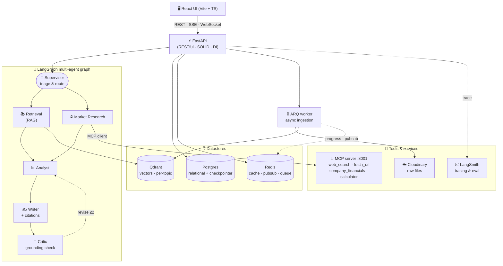

# FinSight — A Multi-Agent Financial Research Assistant with RAG, MCP Tools, and Grounded Citations

> **AAIDC Module 2 — Build Your Multi-Agent System.**
> Repository: https://github.com/phanminhtai23/finsight-multi-agent

## TL;DR

FinSight is a production-style, multi-agent system that answers financial questions about **any
company** — from documents you upload (PDF / Word / scanned images) or from **live web sources**
— and **always answers with inline citations** back to the exact source. A LangGraph supervisor
coordinates six specialized agents over a retrieval-augmented-generation (RAG) layer backed by
**Qdrant**, with tools exposed through a dedicated **Model Context Protocol (MCP)** server. Long
jobs (document ingestion) run asynchronously so the user can keep chatting. A full **React** app
wraps it with auth, **token streaming**, a live "thinking" view, on-the-fly **charts**, and
per-topic knowledge bases. The whole stack runs with one `docker compose up` and is verified
end-to-end.

## The Problem

Reading financial reports is slow, and generic chatbots are untrustworthy for finance: they
hallucinate figures and can't show *where* a number came from. FinSight targets exactly this gap
— grounded, **cited** answers that combine a user's private documents with live market research.

## What FinSight Does

- **Upload any document** (PDF, DOCX, scanned image) → it is parsed, OCR'd, chunked, embedded,
  and indexed automatically (in the background).
- **Ask questions in natural language** → a team of agents retrieves evidence, analyzes it,
  writes the answer, and a Critic verifies it is grounded and cited.
- **Researches the live web** (via MCP tools) for companies not in your documents.
- **Every claim is cited** `[n]`, mapping to a document page (deep-linked on Cloudinary) or a web URL.
- **Visualizes on demand** — ask to "plot" or "compare" and a Visualization agent renders bar /
  line / area / pie charts alongside the answer.
- **Real application** — sign-up with email verification + Google Sign-In, per-topic knowledge
  bases (each = a Qdrant collection), storage quota, dark mode, token streaming, a toggleable
  reasoning view, and the **names of the tools the agent invoked** shown inline.

## Architecture



**Request flow.** The UI calls FastAPI over REST; chat answers stream back over **SSE** (tokens,
thinking, citations, charts, tool names) and ingestion progress over **WebSocket**. FastAPI invokes
the **LangGraph** graph, whose Supervisor routes to the right agents; the Retrieval agent hits
**Qdrant**, the Market Research agent calls the **MCP server** as a client. Uploads are handled
out-of-band by an **ARQ worker** that parses, chunks, embeds and indexes into Qdrant while the user
keeps chatting.

Design principles: **SOLID** (thin controllers, business logic in services, data access and tools
behind `Protocol` interfaces, dependency injection), a **RESTful** versioned API, `ruff` + `pytest`,
and a clean separation between relational state (Postgres + LangGraph checkpointer) and vectors
(Qdrant). Full design: [`ARCHITECTURE.md`](ARCHITECTURE.md).

## The Multi-Agent System (LangGraph)

Six agents, supervisor-coordinated:

| Agent | Role |
|-------|------|
| **Supervisor** | Triage — decide whether the question needs live external web data; route the flow. |
| **Retrieval** | Hybrid search over the user's documents in Qdrant; returns cited evidence. |
| **Market Research** | Live web/financial research via the **MCP** `web_search` tool. |
| **Analyst** | Synthesize evidence; compute ratios, comparisons, trends. |
| **Writer** | Compose the final answer with inline `[n]` citations. |
| **Critic** | Verify every claim is grounded and cited; bounce back for a bounded revision loop. |

```
START → supervisor → retrieval → [market_research if needed] → analyst → writer → critic
        → analyst (revise, ≤2) | END
```

State is persisted per conversation thread with LangGraph's **AsyncPostgresSaver**, so threads are
durable and resumable.

## Retrieval-Augmented Generation

- **Multi-format ingestion**: PDF (PyMuPDF + table extraction via pdfplumber), DOCX, and scanned
  images (OCR). A parser registry makes new formats additive (Open/Closed).
- **Advanced chunking**: structure-aware + recursive splitting, **parent–child (small-to-big)**,
  **Anthropic-style contextual retrieval**, and table-aware handling for financial statements.
- **Hybrid retrieval**: dense vectors (Gemini `gemini-embedding-2`, 3072-d, cosine) fused with a
  keyword (full-text) leg via **Reciprocal Rank Fusion**, then small-to-big context expansion.
- **Citations**: each chunk carries document, page, and source URL; the Writer emits `[n]` markers
  the Critic validates against the evidence.

## Tools via MCP (≥ 3 tools, MCP communication)

A dedicated **MCP server** (FastMCP, streamable-HTTP) exposes four tools; the Market Research agent
is an **MCP client** that calls them over the protocol:

- `web_search` — DuckDuckGo web search (no API key)
- `company_financials` — focused search for a company's latest results
- `fetch_url` — fetch and clean a web page's text
- `financial_calculator` — safe arithmetic evaluation (AST-based)

This satisfies both the **≥3 tools** requirement and the optional **MCP communication** enhancement.

## Skills

Reusable, self-contained capabilities any agent or client can invoke (behind a `TextGenerator`
port): `summarize`, `translate`, `fact_check` — exposed via `GET/POST /api/v1/skills`.

## Evaluation & Baseline Benchmarking

`evals/run_eval.py` benchmarks FinSight against a **no-RAG baseline** on a labeled set of questions
about the sample report, with **LangSmith** tracing enabled:

- **Expected-answer recall** (RAG vs. baseline) — does RAG recover the ground-truth figures?
- **Citation coverage** — fraction of answers carrying `[n]` citations.
- **Groundedness** — an LLM-as-judge score that the answer is supported by the retrieved evidence.

This demonstrates the optional *formal evaluation metrics and baseline benchmarking* enhancement.

## Tech Stack

LangGraph · LangChain · Google Gemini · FastAPI · **Qdrant** · PostgreSQL · Redis · ARQ ·
Cloudinary · **MCP** · LangSmith · ruff · pytest · Docker Compose.

## Reproduce

```bash
cp .env.example .env          # set GOOGLE_API_KEY (free: aistudio.google.com/apikey)
docker compose up -d --build  # postgres, qdrant, redis, mcp, api, worker
docker compose exec api alembic upgrade head
cd frontend && npm install && npm run dev   # → http://localhost:5173
```

A ready-made report ships in the repo at `samples/sample_financial_report.docx`
(*Nimbus Cloud Inc. FY2024*). Sign up (email verification auto-passes in dev mode), create a topic,
upload the sample, then try:

| Ask | What to expect |
|-----|----------------|
| `What was Q4 2024 revenue and net income?` | Grounded **$1,180M / $262M** with a `[1]` citation |
| `Plot quarterly revenue for 2024 as a chart` | A line/bar chart (820 → 910 → 1,015 → 1,180) |
| `Show revenue breakdown by segment as a pie chart` | A pie (Cloud 50% · Data 28% · AI 22%) |

```bash
# benchmark RAG vs. a no-RAG baseline (LangSmith tracing on)
docker compose exec api python -m evals.run_eval
```
The full reviewer walkthrough lives in the repo `README.md` → *Quick demo (for reviewers)*.

## Sample Interaction

> **Q:** What does NVIDIA do and what is its most recent reported quarterly revenue?
>
> **A:** NVIDIA is a technology company focused on AI products and data centers [4, 5]. For Q2
> fiscal 2026, NVIDIA reported revenue of $46.7 billion, +56% year-over-year [3].
>
> *Sources:* [3] investor.nvidia.com · [2] Wikipedia · [4] TradingView · [5] Yahoo Finance

The Supervisor routed to Market Research (live web needed), which called the MCP `web_search` tool;
the Writer cited the sources and the Critic approved.

## Limitations & Future Work

- Keyword retrieval currently uses Qdrant full-text matching; a sparse-vector (BM25) leg would
  strengthen hybrid ranking.
- A cross-encoder reranker is pluggable but disabled by default to avoid heavy model downloads.
- Gemini's free tier is rate-limited; throttled replies are surfaced in the UI with a retry hint.
- The whole stack runs locally via Docker Compose; cloud hosting is left as future work.

## Repository & Quality

- Code: https://github.com/phanminhtai23/finsight-multi-agent
- `pytest` unit tests, `ruff`-clean, full SOLID layering, runs entirely via Docker Compose.

---

**Tags:** `multi-agent` · `langgraph` · `rag` · `mcp` · `agentic-ai` · `financial-analysis` ·
`qdrant` · `fastapi` · `react` · `llm` · `google-gemini` · `hybrid-search` · `contextual-retrieval` · `aaidc`
