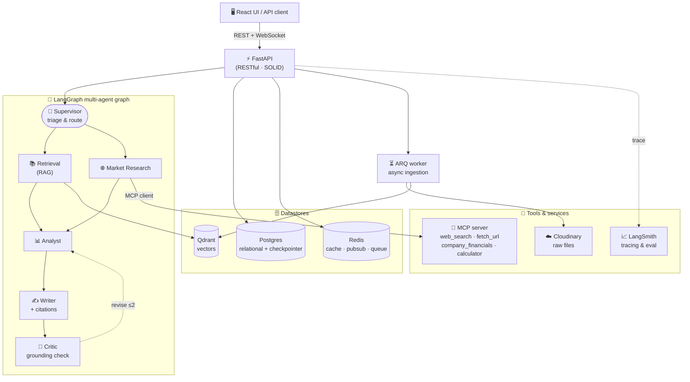

<p align="center">
  
</p>

<h1 align="center">FinSight</h1>

<p align="center">
  <b>Multi-Agent Financial Research Assistant</b><br/>
  Grounded answers with citations — from your documents and the live web.
</p>

<p align="center">
  
  
  
</p>

---

> Submission for **Ready Tensor — Agentic AI Developer Certification (AAIDC), Module 2: Build Your Multi-Agent System**.

FinSight is a production-style, multi-agent system that answers financial questions about **any company** — either from documents you upload (PDF, Word, scanned images) or from live web/financial sources — and **always answers with inline citations** back to the exact source page.

It is built around a LangGraph supervisor orchestrating a team of specialized agents, a retrieval-augmented-generation (RAG) layer with advanced chunking and hybrid search, tools exposed through a dedicated **MCP server**, and an async task engine that lets you keep chatting while long jobs (document ingestion, deep research) run in the background.

---

## ✨ Key Features

- **Multi-agent orchestration (LangGraph supervisor)** — six focused agents (Supervisor, Retrieval, Market Research, Analyst, Writer, Critic) coordinating to solve a task.
- **RAG over your own documents** — upload PDF / DOCX / scanned images; FinSight parses, OCRs, chunks and indexes them into a **Qdrant** vector store.
- **Advanced chunking** — layout-aware + semantic + parent–child + Anthropic-style *contextual retrieval*, with table-aware handling for financial statements.
- **Hybrid retrieval + reranking** — vector search fused with full-text (BM25-like) search, then cross-encoder reranking.
- **Citations everywhere** — every claim is traceable to a document, page and region (deep-link to the file on Cloudinary).
- **Live financial research** — web search + financial APIs via MCP tools for companies not in your documents.
- **Async & concurrent** — long-running ingestion / research runs in background workers; you can keep chatting in the same conversation. Progress streams live over WebSocket.
- **Durable memory** — conversation state and long-term user memory persisted in **Postgres** via LangGraph's built-in checkpointer/store.
- **Observability** — full tracing and evaluation with LangSmith.

## 🏗️ Architecture

See [ARCHITECTURE.md](ARCHITECTURE.md) for the full design, agent roles, communication flows, RAG pipeline and data model.



## 🧰 Tech Stack

| Layer | Tech |
|-------|------|
| Orchestration | LangGraph, LangChain |
| LLM / Embeddings | Google Gemini — chat (e.g. `gemini-3.1-flash-lite-preview`) + `gemini-embedding-2` (3072-d) |
| Vector store | Qdrant |
| Relational store | PostgreSQL |
| Tools protocol | Model Context Protocol (MCP) server |
| Cache / bus / queue | Redis, ARQ |
| Conversation memory | Postgres (LangGraph `PostgresSaver` + `PostgresStore`) |
| File storage | Cloudinary |
| API | FastAPI (RESTful) |
| Frontend | React + Vite + TypeScript |
| Observability | LangSmith |
| Quality | ruff, pytest |

## 🚀 Getting Started

### Prerequisites
- **Docker & Docker Compose** (recommended) — runs the whole stack.
- *(optional, local dev only)* Python 3.11+, Node 20+

### 1. Get the API keys

| Variable | Required? | Where to get it |
|----------|-----------|-----------------|
| `GOOGLE_API_KEY` | ✅ **Required** | [Google AI Studio](https://aistudio.google.com/apikey) → *Create API key* (free). Used for the chat LLM + embeddings. |
| `CLOUDINARY_CLOUD_NAME` · `CLOUDINARY_API_KEY` · `CLOUDINARY_API_SECRET` | Optional | [cloudinary.com](https://cloudinary.com/users/register_free) → register free → **Dashboard → Product Environment Credentials**. |
| `LANGSMITH_API_KEY` | Optional | [smith.langchain.com](https://smith.langchain.com) → *Settings → API Keys* (enables tracing + eval; set `LANGSMITH_TRACING=true`). |

> Without Cloudinary, uploaded files fall back to local disk (`uploads/`). Without LangSmith, tracing is simply disabled. **Only `GOOGLE_API_KEY` is needed to run.**

### 2. Configure environment
```bash
cp .env.example .env
# open .env and paste your GOOGLE_API_KEY (minimum); optionally Cloudinary + LangSmith.
```

The **default database account** is defined in `.env` and created automatically when Postgres first starts — change these to set your own credentials:
```env
POSTGRES_USER=finsight
POSTGRES_PASSWORD=finsight
POSTGRES_DB=finsight
```

### 3. Run with Docker
```bash
docker compose up -d --build                  # build + start all services in the background
docker compose exec api alembic upgrade head  # first run only: create the DB schema
```
Services & URLs:
- **API** — http://localhost:8000  (Swagger docs at `/docs`)
- **Qdrant dashboard** — http://localhost:6333/dashboard

### 4. Run the frontend (React + Vite)
```bash
cd frontend
npm install
npm run dev          # → http://localhost:5173 (proxies /api to the backend)
```

### Managing the project (Docker Compose)
```bash
docker compose ps                 # show services + status
docker compose logs -f api        # follow logs of one service (api | worker | mcp | postgres | qdrant | redis)
docker compose stop               # stop all services       (data is kept)
docker compose start              # start them again
docker compose restart api        # restart a single service (e.g. after editing code)
docker compose up -d --build      # rebuild + restart after changing dependencies
docker compose down               # remove containers + network (KEEPS data volumes)
docker compose down -v            # remove EVERYTHING incl. volumes (wipes Postgres + Qdrant data)
```

### 3. Local backend dev (without Docker)
```bash
cd backend
pip install -e ".[dev]"      # or: uv pip install -e ".[dev]"
uvicorn app.main:app --reload
```

## 🔌 API Overview (RESTful)

| Method | Path | Description |
|--------|------|-------------|
| GET  | `/api/v1/health` | Liveness/readiness probe |
| POST | `/api/v1/conversations` | Create a conversation |
| POST | `/api/v1/conversations/{id}/messages` | Send a message (chat) |
| POST | `/api/v1/documents` | Upload a document → triggers async ingestion |
| GET  | `/api/v1/documents/{id}` | Ingestion status |
| POST | `/api/v1/conversations/{id}/tasks` | Launch a long-running task |
| GET  | `/api/v1/tasks/{id}` | Task status / result |
| WS   | `/api/v1/ws/conversations/{id}` | Stream tokens & task progress |

## 🧪 Quality

```bash
cd backend
ruff check .          # lint
ruff format .         # format
pytest                # tests
```

## 📁 Project Structure

```
backend/app/
├── api/            FastAPI routers (REST + WebSocket) — thin controllers
├── core/           config, logging, cache, DI
├── schemas/        Pydantic request/response DTOs
├── services/       business logic
├── repositories/   data access (Protocol + impl)  ← SOLID DIP
├── agents/         LangGraph graph, nodes, supervisor, state
├── tools/          tool implementations + MCP client adapter
├── rag/            ingestion · chunking · indexing · retrieval
├── skills/         reusable skill packages
├── workers/        ARQ background workers
└── models/         SQLAlchemy ORM
backend/mcp_server/  MCP server exposing tools
frontend/            React + Vite + TS
```

## 🗺️ Roadmap

- [x] M0 — Scaffold, config, Docker, lint/test baseline
- [x] M1 — RAG core (ingestion + Qdrant + hybrid retriever + cited QA)
- [x] M2 — Multi-agent graph (supervisor + agents) on LangGraph + Postgres checkpointer
- [x] M3 — Tools via MCP server (web_search, company_financials, fetch_url, financial_calculator)
- [x] M4 — Async tasks (ARQ + Redis pub/sub + WebSocket)  *(ingestion path)*
- [x] M5 — React frontend (landing, auth, topics + upload, chat streaming, thinking, dark mode)
- [x] M6 — Skills (`/skills`) + LangSmith evals (RAG vs baseline) + publication

## 📄 License

MIT
